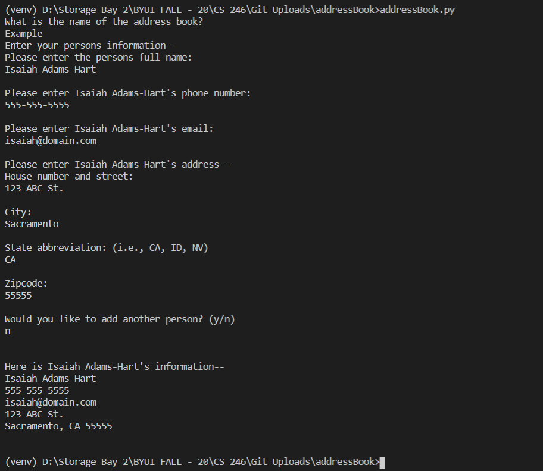

# Overview
This program is a basic address book using classes.  
It has the cababilites to store a persons' name, basic contact information, and street address.    

Not yet implemented:
* Searching
* Updating contacts
* Printing to files

# Development Environment
* Visual Studio Code  
* Python 3.8.5

# Execution
Ensure that Python is compatible, installed, and enabled.   
Execution of the program: `python addressBook.py`

# Useful Websites

1. [Python Reference](https://docs.python.org/3/library/index.html)
2. [Project Inspiration](https://www.upgrad.com/blog/python-projects-ideas-topics-beginners/)
2. [Tips on using Python lists](https://docs.python.org/3/tutorial/datastructures.html)